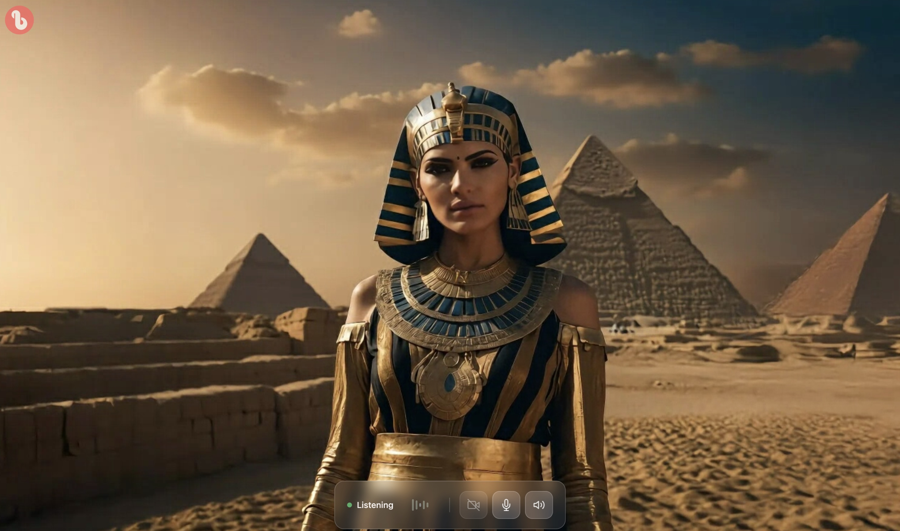

# bitHuman LiveKit UI Example

A modern, responsive web interface for connecting to bitHuman's AI agents via LiveKit. This example demonstrates how to build a sleek video chat interface with voice activity detection, real-time controls, and glassmorphism design.


## 📸 Screenshot



*Modern glassmorphism interface with real-time video chat, voice activity detection, and integrated controls*

## ✨ Features

- **🎥 Real-time video chat** - High-quality video streaming with LiveKit
- **🎙️ Voice activity detection** - Visual feedback with animated audio bars
- **🎨 Modern glassmorphism UI** - Semi-transparent, elegant design
- **📱 Responsive design** - Works on desktop and mobile devices
- **⚡ Auto-connection** - Seamless connection experience
- **🔊 Audio controls** - Camera, microphone, and speaker management
- **✨ Particle loading effects** - Beautiful animated loading screen
- **🏷️ Branded experience** - Integrated bitHuman branding

## 🚀 Quick Start

### Prerequisites

- Node.js 18+ and npm
- LiveKit server access or [LiveKit Cloud](https://livekit.io/cloud) account
- bitHuman agent endpoint (or compatible LiveKit agent)

### Installation

1. **Clone the repository**
   ```bash
   git clone https://github.com/bithuman-product/bithuman-examples.git
   cd integrations/nextjs-ui
   ```

2. **Install dependencies**
   ```bash
   npm install
   ```

3. **Configure environment variables**
   
   Copy the environment template and configure your settings:
   ```bash
   cp env.template .env
   ```
   
   Edit `.env` with your LiveKit credentials:
   ```env
   # LiveKit Configuration
   NEXT_PUBLIC_LIVEKIT_URL=wss://your-livekit-server.com
   LIVEKIT_API_KEY=your-api-key
   LIVEKIT_API_SECRET=your-api-secret
   
   # Application Configuration
   NEXT_PUBLIC_APP_CONFIG={}
   ```

4. **Start development server**
   ```bash
   npm run dev
   ```

5. **Open your browser**
   Navigate to `http://localhost:3000`

## 🛠️ Technology Stack

- **[Next.js 14](https://nextjs.org/)** - React framework with Pages Router
- **[LiveKit](https://livekit.io/)** - Real-time audio/video infrastructure
- **[React 18](https://react.dev/)** - UI framework with hooks
- **[TypeScript](https://www.typescriptlang.org/)** - Type safety
- **[Tailwind CSS](https://tailwindcss.com/)** - Utility-first CSS framework
- **[Framer Motion](https://www.framer.com/motion/)** - Animation library

## 📁 Project Structure

```
├── src/
│   ├── components/
│   │   ├── playground/         # Main video chat interface
│   │   ├── connection/         # Connection management
│   │   └── toast/             # Notification system
│   ├── contexts/              # React contexts
│   ├── hooks/                 # Custom React hooks
│   ├── pages/                 # Next.js pages
│   │   ├── api/              # API routes
│   │   └── index.tsx         # Main application
│   └── styles/               # Global styles
├── public/                   # Static assets
├── LICENSE                   # Apache 2.0 license
├── NOTICE                   # Attribution notices
└── README.md               # This file
```

## 🔧 Configuration

### LiveKit Settings

The application connects to LiveKit using environment variables. You can use either:

1. **LiveKit Cloud** - Sign up at [livekit.io/cloud](https://livekit.io/cloud)
2. **Self-hosted LiveKit server** - Follow [LiveKit deployment docs](https://docs.livekit.io/home/self-hosting/deployment)

### Agent Integration

This UI is designed to work with bitHuman's AI agents, but it's compatible with any LiveKit-based agent that supports:

- Audio/video tracks
- Voice activity detection
- Real-time communication

## 🎨 UI Components

### Main Interface

- **Video Section** - Displays agent and user video streams
- **Control Panel** - Integrated camera, microphone, and audio controls
- **Voice Activity Indicator** - Real-time audio visualization
- **Loading Screen** - Animated particle effects during connection

### Design Features

- **Glassmorphism** - Semi-transparent elements with backdrop blur
- **Responsive Layout** - Adapts to different screen sizes
- **Smooth Animations** - Micro-interactions for better UX
- **Modern Icons** - Clean SVG icons for controls

## 🔌 API Integration

### Token Generation

The application includes a token generation API at `/api/token` that:

- Validates room parameters
- Generates LiveKit access tokens
- Handles authentication

### Environment Configuration

Configure your LiveKit connection in `.env`:

```env
# Required for token generation
LIVEKIT_API_KEY=your-api-key
LIVEKIT_API_SECRET=your-api-secret

# Required for client connection
NEXT_PUBLIC_LIVEKIT_URL=wss://your-livekit-server.com
```

## 🚢 Deployment

### Vercel (Recommended)

1. Push your code to GitHub
2. Import the repository in [Vercel](https://vercel.com)
3. Add environment variables
4. Deploy

### Docker

```bash
# Build the image
docker build -t bithuman-ui .

# Run the container
docker run -p 3000:3000 \
  -e NEXT_PUBLIC_LIVEKIT_URL=wss://your-server.com \
  -e LIVEKIT_API_KEY=your-key \
  -e LIVEKIT_API_SECRET=your-secret \
  bithuman-ui
```

### Other Platforms

This is a standard Next.js application that can be deployed to:
- [Netlify](https://netlify.com)
- [Railway](https://railway.app)
- [DigitalOcean App Platform](https://www.digitalocean.com/products/app-platform)
- Any Node.js hosting provider

## 🤝 Contributing

We welcome contributions! Please see our [Contributing Guidelines](CONTRIBUTING.md) for details.

1. Fork the repository
2. Create a feature branch
3. Make your changes
4. Add tests if applicable
5. Submit a pull request

## 📄 License

This project is licensed under the Apache License 2.0 - see the [LICENSE](LICENSE) file for details.

## 🙏 Acknowledgments

- **[LiveKit](https://livekit.io/)** - Real-time infrastructure
- **[bitHuman](https://bithuman.ai/)** - AI agent platform
- **[Vercel](https://vercel.com/)** - Deployment platform
- **[Tailwind CSS](https://tailwindcss.com/)** - Styling framework

## 🔗 Links

- [bitHuman Website](https://bithuman.ai/)
- [LiveKit Documentation](https://docs.livekit.io/)
- [Next.js Documentation](https://nextjs.org/docs)
- [Report Issues](https://github.com/bithuman-product/platform/issues)

---

**Built with ❤️ by the bitHuman team** 